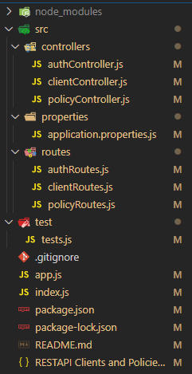
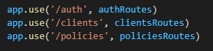
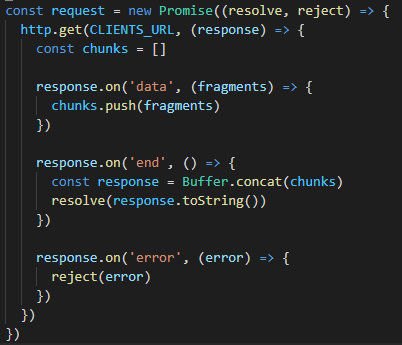
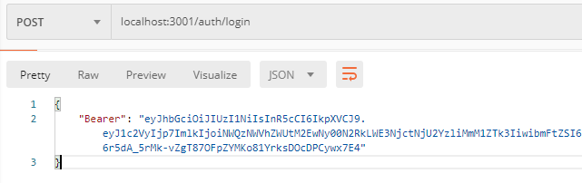
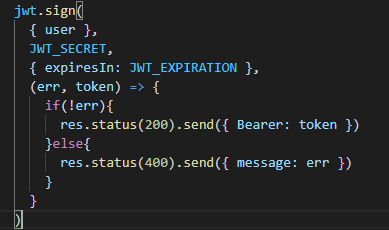
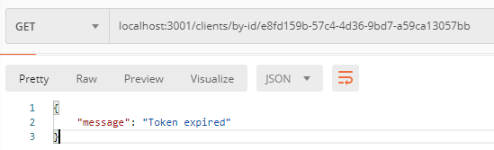
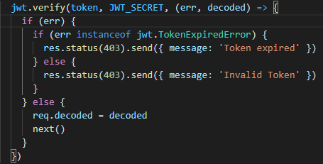
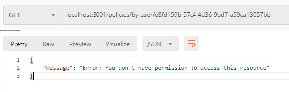
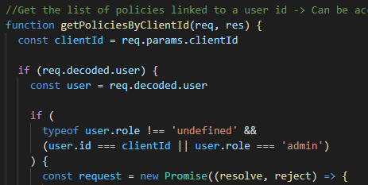

# Clients and Policies REST API

REST API Application that manages some information regarding insurance policies and company clients.


---


## Table of Contents 


- [Installation](#installation)
- [Dependencies](#Dependencies)
- [Run NodeJS Server](#Run%20NodeJS%20Server)
- [Run Tests](#Run%20Tests)
- [Usage](#usage)
- [Development details](#Development%20details)


---
## Installation

### Clone

- Clone this repo to your local machine using `https://github.com/crissyhendricks/restapi-clients-policies.git`


```shell
$ git clone https://github.com/crissyhendricks/restapi-clients-policies.git
```

### Setup
- If you want to change project properties, go to **./src/properties/application.properties.js**
---
## Dependencies

- Express JS https://expressjs.com/es/
- body-parser https://www.npmjs.com/package/body-parser
- jsonwebtoken https://www.npmjs.com/package/jsonwebtoken
- standard https://www.npmjs.com/package/standard

*Dev Dependencies*

- Nodemon https://nodemon.io/
- mocha https://mochajs.org/
- chai https://www.chaijs.com/
- chai-http https://www.chaijs.com/plugins/chai-http/
- supertest https://www.npmjs.com/package/supertest
  
---
## Run NodeJS Server 
    
Run server    

```shell
$ node index.js
```
*Run server with nodemon*
```shell
$ npm start
```
---
## Run Tests
Run tests    

```shell
$ npm test
```
---

## Usage
Access the collection in `Postman` for more details and examples

[](https://app.getpostman.com/run-collection/d23af518b31af3c06c43)

### Open Endpoints
By logging in you acquire a bearer token to use the requests that need authentication. 
* `POST /auth/login/`

### Endpoints that require Authentication
Require a bearer token in the header of the request.

**Clients requests**

Get a list of all the clients

* `GET /clients/`


Get user data filtered by user id -> Can be accessed by users with role 'users' and 'admin'

* `GET /clients/by-id/:id`

Get user data filtered by user name -> Can be accessed by users with role 'users' and 'admin'

* `GET /clients/by-username/:username`

**Policies requests**

Get a list of all the policies

* `GET /policies/`


Get the list of policies linked to a user id -> Can be accessed by users with role 'admin' and by the own user

* `GET /policies/by-user/:clientId`

---
## Development details

### Project structure


 

 We find all our dependencies in the `package.json` file and our scripts. 
 
 During the development we used `nodemon` to speed up the start up, with this tool the server is restarted when saving the changes. In addition to the start script, the test script has been defined to execute our `./test/tests.js` file where the tests are located.

 ```shell
  "scripts": {
    "start": "nodemon index.js",
    "test": "mocha --reporter spec"
  }
```
  

 At the root of the project we have a `index.js` where we call app module and run the server. The `app.js` takes care of importing body-parse and express. Here we'll configure express, importing routes and setting the CORS.

 

In `routes` folder we have all the routes that our app will respond to when we make an HTTP request and function will resolve the request.

 

A middleware has been configured in the routes to check if the client is authorized.

In the `controllers` folder we have all the functionality of our application, in this case, we have to get the information by making HTTP requests to another API. `Promise` is used to handle the asynchrony.

 

Errors like "undefined" or "fatal error" have been controlled by catch and if conditions throughout the code.

### Standard And ESLint
Using `standard`, the code was checked for compliance with JavaScript Standard Style 

### Authentication and authorization

We have all the functionality of authentication and authorization in `AuthController`. Except for the `"POST /login/"` endpoint all other endpoints are inaccessible without a valid token. 

To obtain a token, the user must register using `"POST /login/`, we will use the user name this time to verify that the user exists, for that, we will have to obtain the information of the clients in the source API.
Postman Login Request| jwt.sign() 
 --- | --- 
 |

Once the user has a token he can use it in the request header and our app will verify that the token is valid and has not expired.

Postman Clients Request| jwt.verify() 
 --- | --- 
 |

**User permissions**

The requirements of the application, indicate that some requests can only be seen by users who have a specific role.
> Get user data filtered by user id -> Can be accessed by users with role "users" and "admin"
> 
> Get user data filtered by user name -> Can be accessed by users with role "users" and "admin"
> 
> Get the list of policies linked to a user id -> Can be accessed by users with role "admin" and by the own user

We can obtain the user's data by verifying the token, and we can add this decoded information to the request. Later, we'll use it in our controllers.functions to see whether or not the user can access the resource.

Postman Clients Request| jwt.verify() 
 --- | --- 
 |

### Testing

>`./test/tests.js`

In the tests `mocha` is used as framework running with `chai` , `chai-http` and `superagent` (to make requests to our API).

Tests defined :

- *Simple Unit Test* : We check if port was assined to our express configuration correctly.
- *Auth + Tokenize Endpoints E2E Test*: First we obtain the token and then we use it in two other steps and obtain the correct date having used the token we have previously generated.
- *Client integration Test* and *Policy integration Test*: Here we want to verify that we have configured our token verification function correctly and handle the possibility of a request coming in without a header.

